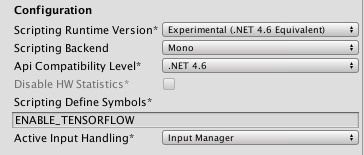
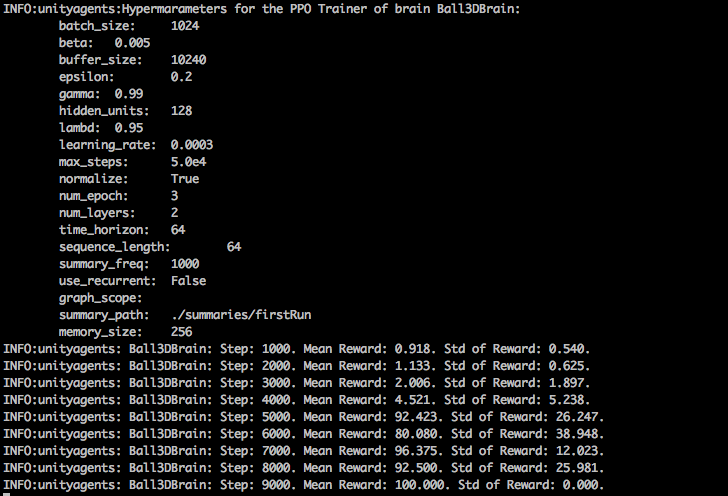

# Basic Guides

This guide shows you the a few basic steps you can try, like how to setup ML-Agents, how to playaround with our example environment and their associated pretrained model, how to control the Unity Environment with python API, how to do the training etc. 

## Setting up ML-Agents within Unity

1. Open Unity and use it to open folder `ml-agents/unity-environment`. 
2. Go to `Edit` -> `Project Settings` -> `Player`
3. For **each** of the platforms you target 
(**`PC, Mac and Linux Standalone`**, **`iOS`** or **`Android`**):
    1. Go into `Other Settings`.
    2. Select `Scripting Runtime Version` to 
    `Experimental (.NET 4.6 Equivalent)`
    3. In `Scripting Defined Symbols`, add the flag `ENABLE_TENSORFLOW`. 
    After typing in, press Enter.
4. Go to `File` -> `Save Project`
5. Restart the Unity Editor.



## Setting up TensorflowSharp Support

[Download](https://s3.amazonaws.com/unity-ml-agents/0.3/TFSharpPlugin.unitypackage) TensorflowSharp plugin, and import it into Unity once downloaded by double clicking on it.  You can see if it was successfully imported by checking the TensorFlow files in the Project window under `Assets` -> `ML-Agents` -> `Plugins` -> `Computer`. 

**Note**: If you don't see anything under `Assets`, drag the `ml-agents/unity-environment/Assets/ML-Agents` folder under `Assets` within Project window.


## Play an example environment using pretrained model

1. In the Project window, go to `Assets` -> `ML-Agents` -> `Examples` -> `3DBall` folder and open the `3DBall` scene file. 
2. In the Hierarchy window, click on `Ball3DAcademy` -> `Ball3DBrain`. 
3. In the Inspector window, under `Brain (Script)` -> `Brain Type`, change the `Brain Type` to `Internal`. 
4. In the Project window, go to `Assets` -> `ML-Agents` -> `Examples` -> `3DBall` -> `TFModels` folder, drap the `3DBall` model file into Inspector window under `Brain (Script)` -> `Graph Model` if it is not already attached. 
5. Click the `Play` button and you will see the platforms automatically adjusts itself using the pretrained model.


## Building an Environment

The first step is to open the Unity scene containing the 3D Balance Ball
environment:

1. Launch Unity.
2. On the Projects dialog, choose the **Open** option at the top of the window.
3. Using the file dialog that opens, locate the `unity-environment` folder 
within the ML-Agents project and click **Open**.
4. In the `Project` window, navigate to the folder 
`Assets/ML-Agents/Examples/3DBall/`.
5. Double-click the `3DBall` file to load the scene containing the Balance 
Ball environment.


Since we are going to build this environment to conduct training, we need to 
set the brain used by the agents to **External**. This allows the agents to 
communicate with the external training process when making their decisions.

1. In the **Scene** window, click the triangle icon next to the Ball3DAcademy 
object.
2. Select its child object `Ball3DBrain`.
3. In the Inspector window, set **Brain Type** to `External`.


Next, we want the set up scene to play correctly when the training process 
launches our environment executable. This means:
* The environment application runs in the background
* No dialogs require interaction
* The correct scene loads automatically
 
1. Open Player Settings (menu: **Edit** > **Project Settings** > **Player**).
2. Under **Resolution and Presentation**:
    - Ensure that **Run in Background** is Checked.
    - Ensure that **Display Resolution Dialog** is set to Disabled.
3. Open the Build Settings window (menu:**File** > **Build Settings**).
4. Choose your target platform.
    - (optional) Select “Development Build” to
    [log debug messages](https://docs.unity3d.com/Manual/LogFiles.html).
5. If any scenes are shown in the **Scenes in Build** list, make sure that 
the 3DBall Scene is the only one checked. (If the list is empty, than only the 
current scene is included in the build).
6. Click *Build*:
    a. In the File dialog, navigate to the `python` folder in your ML-Agents 
    directory.
    b. Assign a file name and click **Save**.


Now that we have a Unity executable containing the simulation environment, we 
can perform the training. You can ensure that your environment and the Python 
API work as expected, by using the `python/Basics` 
[Jupyter notebook](Background-Jupyter.md) introduced in the next section.

## Using the Basics Jupyter Notebook

The `python/Basics` [Jupyter notebook](Background-Jupyter.md) contains a 
simple walkthrough of the functionality of the Python 
API. It can also serve as a simple test that your environment is configured
correctly. Within `Basics`, be sure to set `env_name` to the name of the 
environment file you built earlier.

More information and documentation is provided in the 
[Python API](Python-API.md) page.

## Training the Brain with Reinforcement Learning

Go to your command line, enter the `ml-agents/python` directory and type: 

```
python3 learn.py <env_name> --run-id=<run-identifier> --train 
```


**Note**: If you're using Anaconda, don't forget to activate the ml-agents environment first.

The `--train` flag tells ML-Agents to run in training mode. `env_name` should be the path to the Unity executable that was just created. 

If the learn.py runs correctly and starts training, you should see something like this:



You can press Ctrl+c to stop the training at anytime, and your trained model will be at `ml-agents/python/models/<run-identifier>/<env_name>_<run-identifier>.bytes`. You can now embed this trained model into your internal brain by following the steps below, which is similar to the steps described [above](#play-an-example-environment-using-pretrained-model). 

1. Move your model file into 
`unity-environment/Assets/ML-Agents/Examples/3DBall/TFModels/`.
2. Open the Unity Editor, and select the `3DBall` scene as described above.
3. Select the `Ball3DBrain` object from the Scene hierarchy.
4. Change the `Type of Brain` to `Internal`.
5. Drag the `<env_name>_<run-identifier>.bytes` file from the Project window of the Editor
to the `Graph Model` placeholder in the `Ball3DBrain` inspector window.
6. Press the Play button at the top of the editor.

## Next Steps

* For more information on ML-Agents, in addition to helpful background, check out the [ML-Agents Overview](ML-Agents-Overview.md) page.
* For a more detailed walk-through of our 3D Balance Ball environment, check out the [Getting Started](Getting-Started-with-Balance-Ball.md) page.
* For a "Hello World" introduction to creating your own learning environment, check out the [Making a New Learning Environment](Learning-Environment-Create-New.md) page.
